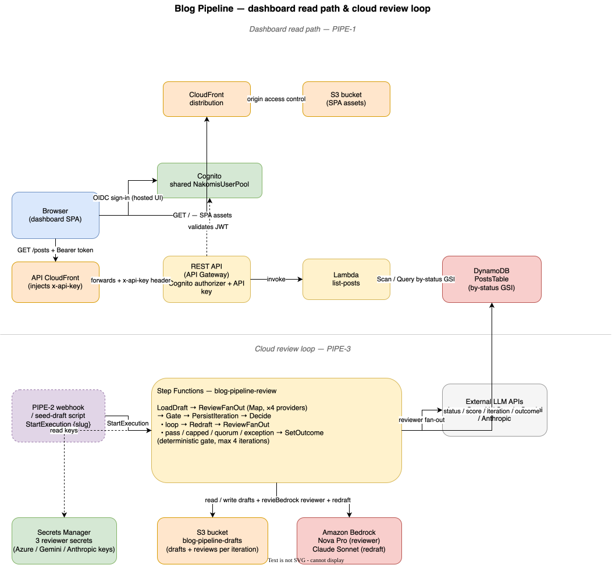

# Blog Pipeline — Cloud-native blog content review pipeline with a web UI

<p align="center">
  
</p>

## Support

If you find this useful, please consider buying me a coffee:

[](https://www.paypal.com/donate?hosted_button_id=Q3BESC73EWVNN&custom=blog-pipeline)

## Table of Contents

<!-- toc -->

- [Overview](#overview)
- [Architecture Diagram](#architecture-diagram)
- [Repository Layout](#repository-layout)
- [Environments](#environments)
- [Project status](#project-status)
- [Review loop](#review-loop)
- [Trigger](#trigger)
- [First deployment](#first-deployment)
- [Architecture Diagrams](#architecture-diagrams)
- [Support](#support)

<!-- tocstop -->

## Overview

Blog Pipeline is a cloud-native review pipeline for [blog.nakom.is](https://blog.nakom.is)
content. A push of a Markdown post to the `blog-content` repo triggers a multi-model
review loop: several LLM reviewers score the draft for publishability, a deterministic
gate decides whether to iterate, and Claude Sonnet re-drafts against the critique — up
to four rounds. Generated images, the proposed revision and the reviewer critiques land
in a staging queue ("the bag") for a final human review before publication.

The web UI shows every post by pipeline stage.

## Architecture Diagram



## Repository Layout

| Directory | Contents |
|---|---|
| `web/` | React + Vite single-page app — the pipeline dashboard and approval UI |
| `infra/` | AWS CDK — API Gateway, Lambda, DynamoDB, Step Functions, CloudFront, Cognito |
| `docs/architecture/` | draw.io diagram source and generated SVGs |

## Environments

| Environment | Domain | AWS account |
|---|---|---|
| Sandbox | `pipeline.blog.sandbox.nakomis.com` | `975050268859` |
| Production | `pipeline.blog.nakomis.com` | `637423226886` |

## Project status

Work is tracked in Taiga under the **PIPE** prefix —
[taiga.nakom.is/project/blog-pipeline](http://taiga.nakom.is/project/blog-pipeline/).

| Story | Feature |
|---|---|
| PIPE-1 | Post dashboard — pipeline stage overview |
| PIPE-2 | Review trigger — GitHub Actions OIDC on blog-content push |
| PIPE-3 | Cloud review loop — Step Functions scored fan-out |
| PIPE-4 | The bag — staging queue and approval UI |
| PIPE-5 | Publish — commit to blog-content with optional schedule |
| PIPE-6 | FLUX image generation for posts |
| PIPE-7 | Cognito managed-login branding for the dashboard |

**PIPE-1 is implemented:** the dashboard read path is live — a React + Vite SPA
served from CloudFront, gated behind the shared Cognito user pool, listing every
post by pipeline stage from a REST API (`GET /posts`) backed by Lambda and
DynamoDB. The API has its own custom domain
(`api.pipeline.blog.[sandbox.]nakomis.com`) behind a CloudFront distribution that
injects the required API key, so the usage plan and quota are enforced without
exposing the key to the browser.

**PIPE-3 is implemented:** the cloud review loop — a Step Functions state machine
(`blog-pipeline-review`) that fans a draft out to four LLM reviewers in parallel,
scores it through a deterministic gate, and has Claude Sonnet re-draft against the
critique, up to four iterations. See [Review loop](#review-loop) below.

**PIPE-2 is implemented:** the review trigger — a GitHub Actions workflow in
`nakomis/blog-content` assumes an OIDC-trusted IAM role
(`blog-pipeline-trigger-{env}`) on every push to `main` touching `blog/*.md`,
and queues each changed post into the pipeline by writing the draft to S3,
the row to DynamoDB and starting a state-machine execution — all over IAM,
with no public endpoint anywhere. See [Trigger](#trigger) below. The remaining
stories (the staging queue, publishing) are built on top of these, story by
story.

To populate the dashboard before the review loop exists, seed sample data:

```bash
cd infra && AWS_PROFILE=nakom.is-sandbox npm run seed-sandbox
```

The SPA reads its runtime config from `/config.json`; generate it before a local
run or a deploy with `web/scripts/set-config.sh [sandbox|prod|localhost]`.

## Review loop

The review loop (PIPE-3) is an AWS Step Functions state machine,
`blog-pipeline-review-{env}`. Given a post `slug`, it:

1. **LoadDraft** — checks the post item and its iteration-1 draft exist, marks
   the post `reviewing`.
2. **ReviewFanOut** — a `Map` state fans the draft out to four LLM reviewers in
   parallel: Azure OpenAI (GPT-5-pro), Google Gemini, Anthropic Claude Opus, and
   Grok-4 on Azure AI Foundry. Each returns a structured verdict — a
   publishability score and any blockers — via the Vercel AI SDK with a Zod
   schema. A reviewer that errors is recorded as `unavailable` rather than
   failing the run. (The Bedrock provider code is kept in the repo for possible
   future re-inclusion, but is not currently fanned out — see the comment in
   `lib/config.ts` for the rationale.)
3. **Gate** — a deterministic, no-LLM decision: it needs a quorum of three of
   the four reviewers to have returned a verdict, every verdict at or above the
   publishability threshold, and no blockers.
4. **Decide** — pass → `staged`; below threshold → **Redraft** (Claude Sonnet on
   Bedrock rewrites against the critique) and loop, capped at four iterations.
5. **SetOutcome** — terminal: the post lands `staged` on a pass, or `failed`
   with a `reviewOutcome` of `capped`, `quorum`, or `exception`.

Drafts and per-iteration reviewer results are stored in the
`blog-pipeline-drafts-{env}` S3 bucket.

### Manual prerequisites

All four reviewers need API keys. `BlogPipelineReviewStack` creates four SSM
`String` parameters (cheaper at this scale than Secrets Manager) with a
placeholder value — overwrite each one after the first deploy, before running
the loop. The redrafter still runs on Bedrock (Claude Sonnet via the EU
cross-region inference profile), so the Sonnet model must be enabled in the
account's Bedrock model access page.

> ⚠️ **Order matters: deploy first, populate second.** CloudFormation will only
> *create* the SSM parameters — it has no way to adopt a pre-existing one. If
> you run `aws ssm put-parameter` for `/blog-pipeline/{env}/reviewer/<provider>`
> before the first `cdk deploy` of that environment, the next deploy will fail
> with `Resource of type 'AWS::SSM::Parameter' with identifier '…' already
> exists.` The recovery is to `aws ssm delete-parameter`, redeploy so CFN
> creates the placeholder, then `put-parameter --overwrite` to put the real
> value back. Avoid the round-trip by deploying first.

| Parameter | JSON shape |
|---|---|
| `/blog-pipeline/{env}/reviewer/azure` | `{"apiKey","resourceName","deployment","apiVersion"}` |
| `/blog-pipeline/{env}/reviewer/gemini` | `{"apiKey"}` |
| `/blog-pipeline/{env}/reviewer/anthropic` | `{"apiKey"}` |
| `/blog-pipeline/{env}/reviewer/grok` | `{"apiKey","endpoint","deployment","apiVersion"}` |

The `azure` slot is the classic Azure OpenAI URL shape
(`https://<resourceName>.openai.azure.com/openai/...`). The `grok` slot is the
Azure AI Foundry `/models/chat/completions` endpoint — `endpoint` is the full
Foundry hostname (e.g. `https://<instance>.services.ai.azure.com`), `deployment`
is the Foundry deployment name (e.g. `grok-4.3`), and `apiVersion` is the
Foundry inference API version (e.g. `2024-05-01-preview`).

```bash
aws ssm put-parameter \
  --profile nakom.is-sandbox \
  --name /blog-pipeline/sandbox/reviewer/gemini \
  --type String --overwrite \
  --value '{"apiKey":"…"}'

aws ssm put-parameter \
  --profile nakom.is-sandbox \
  --name /blog-pipeline/sandbox/reviewer/grok \
  --type String --overwrite \
  --value '{"apiKey":"…","endpoint":"https://<instance>.services.ai.azure.com","deployment":"grok-4.3","apiVersion":"2024-05-01-preview"}'
```

CloudFormation does not reconcile drift on subsequent deploys, so a manually
overwritten value survives. The keys live in plain (unencrypted) parameters
— acceptable here because the parameter prefix is locked down by IAM to the
reviewer Lambda role; harden to `SecureString` out of band if that trade-off
ever changes.

If a parameter is left at its placeholder that reviewer simply reports
`unavailable`; the loop still runs as long as the three-reviewer quorum is met.

### Sandbox dry-run

In prod the trigger fires automatically (see [Trigger](#trigger)); in sandbox
the trigger role exists but no workflow targets it, so the loop is exercised
by hand with a deliberately-imperfect seeded draft:

```bash
cd infra
AWS_PROFILE=nakom.is-sandbox npm run seed-draft-sandbox

aws stepfunctions start-execution \
  --profile nakom.is-sandbox \
  --state-machine-arn "$(aws ssm get-parameter \
    --profile nakom.is-sandbox \
    --name /blog-pipeline/sandbox/review/state-machine-arn \
    --query Parameter.Value --output text)" \
  --input '{"slug":"why-i-use-git-worktrees"}'
```

The seed script writes a `queued` post item and its iteration-1 draft to S3;
pass an alternative slug as an argument to `seed-draft.ts` to seed more than
one.

## Trigger

A push to `nakomis/blog-content`'s `main` branch that touches `blog/*.md`
runs a GitHub Actions workflow (`.github/workflows/trigger-review.yml` in
that repo). The workflow assumes the `blog-pipeline-trigger-prod` IAM role
via OIDC — no static credentials, no public endpoint, no shared secret —
and for each added or modified post does three AWS API calls directly:

1. `s3:PutObject` → `s3://blog-pipeline-drafts-prod/{slug}/iteration-1/draft.md`
2. `dynamodb:PutItem` on the posts table (`queued`, with a `ConditionExpression`
   so a still-in-flight review isn't double-queued)
3. `states:StartExecution` on `blog-pipeline-review-prod` with `{"slug":"…"}`

The slug is the filename's date prefix stripped — `blog/2026-05-22-my-post.md`
queues as `my-post`. Deleted files are ignored.

The role is created by `BlogPipelineTriggerStack` in both environments for
parity; only prod is currently wired to a workflow. Sandbox is exercised via
the `seed-draft` script above. To switch the workflow to sandbox temporarily,
change the four `env:` values in `trigger-review.yml` to the sandbox role
ARN, bucket name, table name and state-machine ARN.

### Manual prerequisite

The role ARN must be pasted into the workflow's `env:` block after the first
deploy. After that, every subsequent deploy is fully automated:

```bash
aws ssm get-parameter \
  --profile nakom.is-admin \
  --name /blog-pipeline/prod/trigger/role-arn \
  --query Parameter.Value --output text
```

## First deployment

There is one unavoidable manual step before CI can take over.

The GitHub Actions deploy role is itself created by CDK — it is the `GithubCiStack`.
So the *first* deployment cannot run through CI: there is no role for the workflow
to assume yet. Something holding AWS credentials has to create that role, and with
no separate repo-bootstrapping tooling, that something is a human at a workstation.

Both regions must be CDK-bootstrapped first (the CloudFront certificates live in
`us-east-1`):

```bash
npx cdk bootstrap aws://975050268859/eu-west-2 aws://975050268859/us-east-1
```

Then deploy everything once, per account. `cdk deploy --all` orders the stacks by
dependency — `WebCert` (us-east-1) → `BlogPipeline` → `Api` → `Web` → `GithubCi`:

```bash
cd infra

# Sandbox
AWS_PROFILE=nakom.is-sandbox NPM_ENVIRONMENT=sandbox npx cdk deploy --all

# Production — when ready to go live
AWS_PROFILE=nakom.is-admin NPM_ENVIRONMENT=prod npx cdk deploy --all
```

Once the CI role exists, every subsequent push deploys itself: the workflow assumes
the role and runs `cdk deploy`. The manual step is never needed again unless the CI
stack is torn down.

`cdk.context.json` is intentionally gitignored. A local deploy generates it from
account lookups and it stays on your machine; CI regenerates its own.

## Architecture Diagrams

`docs/architecture/blog-pipeline.drawio` is the source for the diagram above.
The SVG is auto-regenerated on commit by the pre-commit hook in `.githooks/pre-commit`.

To activate the hook after cloning:

```bash
git config core.hooksPath .githooks
```

## Support

If you find this useful, please consider buying me a coffee:

[](https://www.paypal.com/donate?hosted_button_id=Q3BESC73EWVNN&custom=blog-pipeline)
